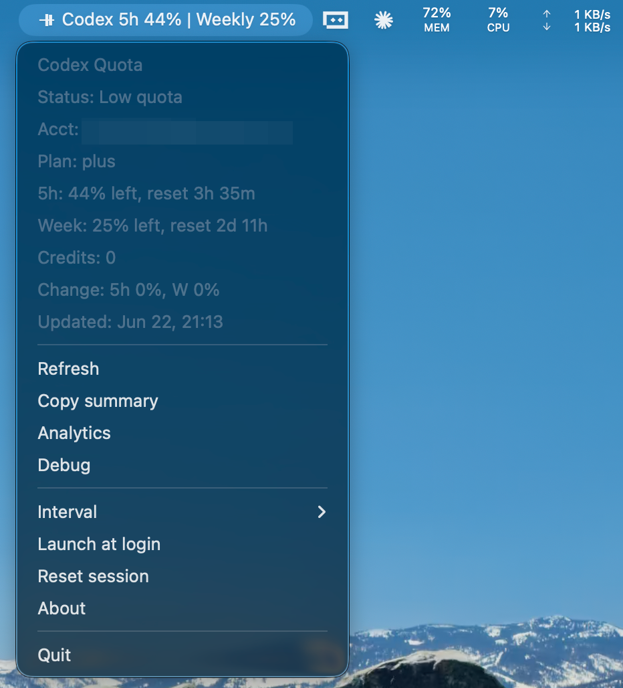

# Codex Quota

[English](README.md) | [简体中文](README.zh-CN.md)

Unofficial local Tauri v2 tray app. Shows Codex quota from authenticated ChatGPT Web session.

License: [MIT](LICENSE).

No API key. No pasted cookies. No bearer token input. No login credential capture.

ChatGPT auth lives only inside Tauri WebView storage. First Tauri launch requires ChatGPT login again. Old Electron data ignored: sessions, cookies, `electron-store`, cache, snapshots, settings.

Uses internal ChatGPT web endpoint `/backend-api/wham/usage`. Endpoint may change. If shape breaks, app reports API/parse error instead of guessing quota.

## Screenshot



## Features

- macOS menu bar title: `Codex 5h 96% | Weekly 36%`.
- Windows tray icon + compact tooltip. Details in tray menu.
- `Copy summary`: short sanitized quota text.
- Debug details: local account + quota details, sanitized JSON, refresh button.
- Copied JSON redacts account IDs and masks email addresses.
- Background refresh via hidden authenticated ChatGPT WebView.
- Settings persisted: refresh interval, launch at login, last sanitized usage snapshot, last update time.
- Single instance: second launch opens/focuses Debug details.
- No OpenAI/Codex official logos.
- No auto-update, signing, notarization, system notifications.

## Requirements

- Node.js >= 20
- Rust stable
- pnpm only

## Install

```bash
pnpm install
```

## Run

```bash
pnpm dev
```

First run:

1. App starts tray/menu.
2. Refresh tries current Tauri WebView session.
3. If auth missing, status becomes `Auth required`.
4. App opens ChatGPT analytics:

```text
https://chatgpt.com/codex/cloud/settings/analytics
```

After login, use tray `Refresh`.

Quota changes compare against previous in-memory snapshot for current app run only. Example: `Change: 5h -12%, Weekly +3%`. Not persisted.

## Build

```bash
pnpm lint
pnpm test
pnpm build
```

`pnpm test` generates icons, then runs Rust unit tests. Tests never call ChatGPT and need no real credentials.

## Package

```bash
pnpm dist
pnpm dist:win
pnpm dist:mac
```

Artifacts unsigned. Windows/macOS may warn. Outputs: Windows NSIS `.exe`, macOS `.dmg`, macOS app bundle.

## Release

Release workflow runs only on `v*` tags.

```bash
pnpm release:bump 1.2.0
git add package.json src-tauri/Cargo.toml src-tauri/Cargo.lock src-tauri/tauri.conf.json
git commit -m "chore(release): 1.2.0"
git tag v1.2.0
git push origin main
git push origin v1.2.0
```

Release commit format must be `chore(release): <version>`.

GitHub Actions builds Windows + macOS artifacts. CI lint/tests run separately on `main` and PRs.

## Troubleshooting

- `Auth required`: session missing/expired or 401/403. Use `Analytics` or `Reset session`.
- `Request timeout`: refresh exceeded 30 seconds.
- `Offline`: WebView network failure.
- `API error`: non-2xx response, except auth cases.
- `Parse error`: JSON/schema changed.
- `Authenticated ChatGPT session, but usage endpoint returned unauthorized`: ChatGPT login exists, usage endpoint rejected runtime-authenticated request.

On refresh failure, tray keeps last successful snapshot if one exists and marks it stale.

Never paste tokens, cookies, raw headers, or secrets into bug reports. Prefer `Copy summary`. `Copy JSON` is sanitized.

## Manual Test

1. Run `pnpm dev` or packaged app.
2. Confirm first Tauri startup requires fresh ChatGPT login.
3. Confirm auth window opens ChatGPT analytics.
4. Sign in, click `Refresh`, confirm quota loads.
5. Close auth window, confirm hidden WebView can refresh.
6. On macOS, confirm menu title shows `Codex 5h ... | Weekly ...`.
7. On Windows, confirm tray tooltip/menu stay compact.
8. Use `Copy summary`, confirm no account identifiers.
9. Open Debug details. Confirm local IDs visible there, but `Copy JSON` redacts `userId`/`accountId` and masks email.
10. Use `Reset session`, confirm Tauri session clears and login opens again. Electron data untouched.
11. Launch second instance, confirm Debug details opens/focuses.
12. Close windows, confirm app keeps running. Only `Quit` exits.
